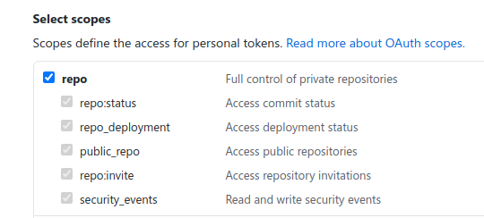
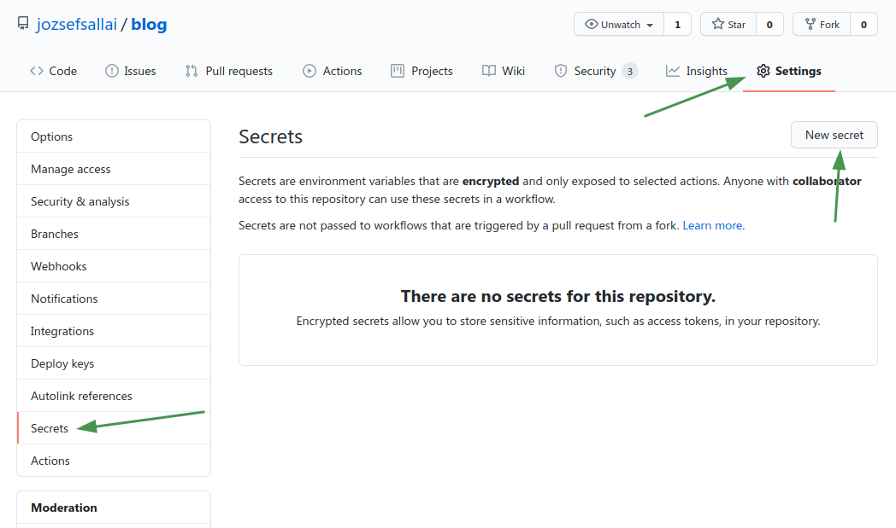
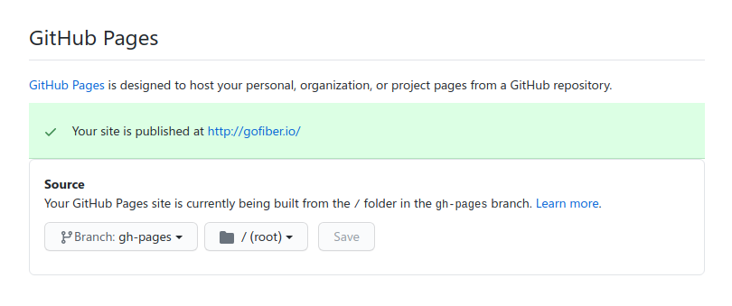

There's no doubt that when it comes to full-stack React frameworks, Vercel's [Next.js](https://nextjs.org) is what comes to our mind first. Next.js is a very well-made framework used by a large majority of React developers to build powerful React apps without missing out on stuff like search engine optimization and serverless functions.

Recently, I've been asked by [Fiber's](https://gofiber.io) project lead to deploy the project's website to **GitHub Pages** instead of Netlify. Since this website is fully static, it's a matter of creating a static export and using **GitHub Actions** for CI/CD.

## Overview

For a very long time, Next.js was the go-to framework for server-side rendered React applications, but today it's much more than that. It introduces the concept of hybrid app development where you can combine the benefits and uses of multiple build strategies. Here's a quick overview of the types of practices that you can combine with Next.js:

### λ Lambda (serverless) functions

These are functions that reside under the `/api` route of a Next.js app as well as other routes that require fetching initial props from somewhere (using `getInitialProps` or `getServerSideProps`). You can use them to create functions that will be executed during runtime (e.g.: API routes for fetching data from or writing to a database or to server-side render the data that will be displayed on a page).

### ○ Static HTML

These pages do not have any initial props and they can be safely rendered as static HTML files. It's mostly used for pages that do not have any dynamic content (i.e. the page component is always the same).

### ● Static Site Generation (SSG)

Earlier this year, Next.js added static site generation as one of the build options. These pages use the `getStaticProps` method to fetch the data that will be used to generate static HTML files, as well as `getStaticPaths` to get a list of all the subroutes that need to be generated as HTML files (e.g.: a list of blog posts). The difference between SSG and server-side rendered lambda pages is that while the latter will only build a single route that will update from the server side, SSG will generate a static HTML page for every possible combination of data that you provide to it.

### Incremental Static Regeneration (ISR)

This is the latest build type introduced in Next.js. It combines the benefits of server-side rendered pages and SSG by generating static HTML files on runtime. You can see a demo for how this works [here](https://static-tweet.now.sh/).

## Creating and Deploying a Static Site to GitHub Pages

Now that we know the types of rendering Next.js can do, we can jump right into how to deploy our static site to GitHub Pages. Thanks to Next.js' awesome static site generation abilities and GitHub Actions, this process shouldn't take more than 10 minutes.

*In this example, we will deploy to the `gh-pages` branch of the same repo where our website's source code resides. You can, however, use the same steps to deploy the website to another repo or branch.*

### Step 1: Export Your App

The first step is to **generate a static build** of your Next.js site. I think this should go without saying but nothing that has to run on a Node.js server (such as lambda functions and `getServerSideProps`) can be rendered to static HTML (this includes **incremental static regeneration**). You may want to use `getStaticProps` and `getStaticPaths` if you have dynamic data that can be generated during build time.

If you heavily depend on server-side features, I recommend deploying your app to a platform that supports lambda functions, such as [Vercel](https://vercel.com).

To export your app, you have to run the following commands:

```sh
next build && next export
```

To make things easier, you can add this to your `scripts` in your `package.json` (I highly recommend doing this):

```json
"scripts": {
  "build": "next build && next export"
}
```

and then run it using the following command:

```sh
npm run build
```

This will create a directory called `out` which contains a fully static version of your website. You will have to deploy the contents of this directory to GitHub Pages.

Obviously, creating new commits for the `out` directory and pushing them manually to the `gh-pages` branch is a very tedious task, so we need to automate this somehow. Here's where **GitHub Actions** comes into action (pun intended).

### Step 2: Setting Up GitHub Actions

The very first step is to create a **personal access token** so that the GitHub Actions runner can authenticate and push the commits to our `gh-pages` branch.

Head over to [GitHub's settings](https://github.com/settings/tokens) and create an access token with the `repo` scopes:



Once you've created the token, copy it and create a new secret called `ACCESS_TOKEN` in the settings of your repository:



Once you're done with that, you can create a new GitHub Actions workflow in your repository. Create a directory called `.github/workflows` and inside that directory, create a YAML file with the following contents:

```yml
name: Build and Deploy
on:
  push:
    branches:
      - master
jobs:
  build-and-deploy:
    runs-on: ubuntu-latest
    steps:
      - name: Checkout
        uses: actions/checkout@v2.3.1
        with:
          persist-credentials: false

      - name: Build
        run: |
          npm ci
          npm run build

      - name: Deploy
        uses: JamesIves/github-pages-deploy-action@3.6.1
        with:
          GITHUB_TOKEN: ${{ secrets.ACCESS_TOKEN }}
          BRANCH: gh-pages
          FOLDER: out
          CLEAN: true
```

**Here's how the action works:**

1. It executes on every push to the `master` branch. If your code is in a different branch, make sure to edit this part.

2. It checks out the repository in the container **without** persisting credentials (this is necessary for the deployment to work).

3. It builds a static version of our site using the `npm run build` script.

4. Using an action called [Deploy to GitHub Actions](https://github.com/marketplace/actions/deploy-to-github-pages), it will use your token to create and push a clean commit to the `gh-pages` repo from the `out` directory that got generated. If the branch doesn't exist, it will create it.

### Step 3: Enable GitHub Pages

Before you actually do that, there's a mini-step that you need to perform to ensure that your site will look and work correctly. GitHub Pages uses **Jekyll** under the hood to host and render static sites. However, Jekyll ignores every directory that starts with an underscore character. This will be a problem because Next.js generates the static assets (CSS and JavaScript) inside of a directory called `_next` and there's no way to changes this, [nor plans to implement a way to change it](https://github.com/vercel/next.js/issues/9460#issuecomment-555669451).

To get around this issue, you need to create an empty file called `.nojekyll` inside of your `gh-pages` branch. This will disable Jekyll's engine and will deploy your website as fully static HTML instead. The `CLEAN` property in the deployment action will ignore `.nojekyll` and `CNAME`, so they will not be deleted.

Oh yeah, and btw, if you have a custom domain, you may want to create a `CNAME` file for it.

Once these steps are done, you can now enable GitHub Pages for the `gh-pages` branch in your repo's settings:



## Troubleshooting

### The CSS is gone...

If you don't have a custom domain attached to your GitHub Pages site, it will be served under `username.github.io/repo`. By default, Next.js assumes that your site is located at the root level of your domain, but in this case, it's actually located under the `repo` path. Luckily, Next.js offers us a way to get around this.

Create a file called `next.config.js` with the following contents (where you replace `repo` with your subpath):

```js
module.exports = {
  basePath: '/repo',
  assetPrefix: '/repo/'
};
```

`basePath` specifies what is the base path of your application, to use for `<Link>` and other related things. `assetPrefix` specifies where your assets are located.

To improve local development experience, you might want to set these values depending on the environment you're working in:

```js
const basePath = process.env.NODE_ENV === 'production' ? '/repo' : '';

module.exports = {
  basePath,
  assetPrefix: `${basePath}/`
};
```

### The CSS is still gone/But I have a domain...

In case you have a domain or you've done the previous steps and the CSS is still gone, you probably forgot to create a `.nojekyll` file in your `gh-pages` branch. If you did do that, you should commit again so that the GitHub Pages runner will re-render your site without Jekyll.

## Conclusion

In this post we could see how easy it is to deploy a static Next.js site to GitHub Pages using GitHub Actions. GitHub has surely evolved a lot in the past few years because everything in this tutorial uses tools made by GitHub, so we used the same product to host our website's code, create a static build of our website, and deploy it to the internet.
