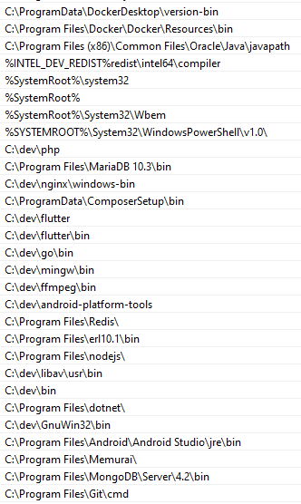
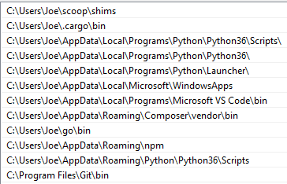

Microsoft's operating system was an important part of my childhood. I grew up using Windows XP, which I really loved to hack to death. At the time, I didn't really know a whole lot about software development and I barely had any resources to learn anything about it since I didn't have internet. I used to have a book on Delphi which is what initially got me interested into writing programs.

This... was a long time ago. After a while, I got more interested into web development and started making static HTML and CSS sites in Notepad++ on my Windows 7 machine. Back in the days, I was scared of Linux. I thought it would be too advanced of an operating system for me. Which might bring the question...

## Why Not Just Use Linux?

I love Linux. It's an amazing operating system with a lot of great potential. I used to dual-boot Debian and Windows at some point, so no, I don't use Windows because I don't like Linux or don't know how to use it. I just have a lot more set of tools on Windows now compared to Linux, especially since I work in other domains too, which require me to have apps that don't exist on Linux (such as Adobe products, Ableton, etc.). I also really enjoy gaming and while I do think playing games on Linux is not *that* bad, I still feel like it's a little more convenient to do it on Windows.

**So why do I just not dual boot?** I just... don't really feel the need of dual-booting right now. I have all the tools I need on my Windows machine and if I happen to need something that doesn't exist on Windows, I can just use WSL. It's good enough. Dual-booting is tedious and, for someone who needs a lot of disk space for audio and video stuff, it's just space in excess.

## Today's Windows Isn't The Past's Windows

Windows had been known among developers to be a very developer-unfriendly operating system for anything that doesn't involve developing for Windows specifically. Today, however, Windows 10 has made a lot of advancements regarding developer experience. I think we can safely say that today's Windows -- heck, even today's Microsoft -- is developer-friendly.

Love them or hate them, I feel like I'm not the only one who thinks that Microsoft has finally started to embrace the developer community, which is a good change in my opinion.

## Why Not Use WSL?

WSL is an awesome addition to Windows and I'm glad that Windows ships with a full-fledged Linux kernel now. It's definitely a good step forward. But why do I not use WSL?

It might be just me and the types of tasks I perform, but WSL hangs quite often, especially during Webpack frontend builds. I would love to use WSL more often, but this constant hanging just doesn't really do it for me. *(If anyone has suggestions on how to fix this, do let me know though!)*

## So, What's My Developer Environment Setup Look Like?

### Programming Languages and Frameworks

Luckily for me, the languages and frameworks I mostly use run great on every platform, including Windows. So all you really have to do is download the Windows release of these tools. I do most of my work with Node.js and in about 96% of the cases I had no trouble working with it under Windows (and when something doesn't work, I check what's wrong and try to fix it myself). Same goes for Go and Dart.

I sometimes face issues when I use Python libraries that depend on a library that can only be found on UNIX-like operating systems. But this is not a big issue for me because most of the Python stuff I do works out of the box on Windows too.

I know I'll probably get a lot of hate for this but when it comes to C++, I use my MinGW setup from ages ago that I've installed for school work. It works well, so I have no reason to complain.

PHP on the other hand, is a little complicated. As you may know, PHP requires that you have a web server backing it. Luckily I don't use PHP much, but for times when I *have* to use PHP, I have a custom nginx + MariaDB + PHP + Redis setup that I made and will talk about in a bit.

### Tools

Here are the developer tools I have installed on my computer:
  * **[Git for Windows](https://github.com/git-for-windows/git/releases/)** - allows me to use git and a lot of useful Linux commands such as `ssh`, `ssh-keygen`, `ls`, etc., and most importantly, `bash`
  * **[Visual Studio Code](https://code.visualstudio.com/)** - an excellent code editor made by Microsoft which has never failed me and I consider one of my best friends. For smaller edits, I use `nano` or `vim` that comes with Git for Windows
  * **[Cmder Mini](https://cmder.net/)** - this is still my favorite terminal emulator for Windows. It has many awesome and useful features, it's fast, and it looks good. Here's my Cmder setup: https://gist.github.com/jozsefsallai/acd53ea9f4990a1d9c39479fbe6dec6e
  * **[Insomnia](https://insomnia.rest/)** - slick, fast, and feature-rich alternative to Postman
  * **[scoop](https://scoop.sh/)** - a package manager for Windows, mainly geared towards developer tools
  * **[nginx](http://nginx.org/en/download.html) (with some custom scripts)** - fast web server that I mainly use for PHP projects or as a reverse proxy
  * **[MariaDB](https://downloads.mariadb.org/)** - community-maintained fork of MySQL. In my experience it works very well on Windows.
  * **[Memurai](https://www.memurai.com/)** - Windows alternative to Redis. There used to be a Redis client for Windows at some point but I couldn't find a version that's up to date. Memurai works pretty well.

### Have Your PATH Sorted Out Well

Windows 10 offers an intuitive way to edit your PATH environment variable. Just go to **Search**, type "environment variables", and select one of the options that pop up to easily edit all your variables, including PATH.

Once you have the right binaries in your PATH, you are unstoppable... mostly.

This is what my system-level PATH looks like:

<center>



</center>

...and this is my user-level PATH:

<center>



</center>

### About That PHP Thing...

I said it's complicated but if you have your PATH sorted out well, it's really not that bad. First I make sure that MariaDB and PHP are accessible from the PATH. Then, after downloading the Windows release of nginx, I create a folder called `windows-bin`. Inside this folder, I place two files:

**Warning: I am bad at batch and VB scripts!**

File 1 - `nginx.bat`:

```bat
@echo off

set currentDirectory=%cd%

cd C:\dev\nginx
nginx %1 %2

cd %currentDirectory%
```

Where `C:\dev\nginx` is the path to your nginx directory. The reason I have to do this is that adding nginx to the PATH is NOT GOOD as `nginx.exe` will literally only work if you run it from nginx's folder. It's so weird, but this is a workaround.

File 2 - `nginx-utils.bat`:

```bat
@echo off

set currentDirectory=%cd%

if [%~1] == [] (
  echo nginx-utils: Please provide a parameter.
  goto :EOF
)

cd "C:\dev\nginx"

if [%1] == [start] (
  wscript "autostart.vbs"
) else (
  wscript "autostart.vbs" "%1"
)

cd %currentDirectory%
```

Now, the other file is just some extra commands that I wrote to make it easier to work with nginx and PHP. Again, make sure to change `C:\dev\nginx` to your nginx directory.

Inside the nginx directory, I also have an `autostart.vbs` file that I have added to my Startup folder so that nginx and PHP can start when I turn my computer on. It also allows me to run nginx in the background without having to keep an extra console window open. This is the contents of the file:

```vb
Set TaskRunner = WScript.CreateObject("WScript.Shell")
NGINXDIR = "C:\dev\nginx"
PHPDIR = "C:\dev\php"

if WScript.Arguments.Count = 0 then
  TaskRunner.CurrentDirectory = NGINXDIR
  TaskRunner.Run "nginx.exe", 0, False
  TaskRunner.CurrentDirectory = PHPDIR
  TaskRunner.Run "php-cgi -b 127.0.0.1:9000 -c php.ini", 0, False
else
  if WScript.Arguments(0) = "stop" then
    TaskRunner.Run "taskkill /F /IM nginx.exe", 0, False
    TaskRunner.Run "taskkill /F /IM php-cgi.exe", 0, False
  elseif WScript.Arguments(0) = "reload-php" then
    TaskRunner.Run "taskkill /F /IM php-cgi.exe", 0, False
    WScript.Sleep 2000
    TaskRunner.CurrentDirectory = PHPDIR
    TaskRunner.Run "php-cgi -b 127.0.0.1:9000 -c php.ini", 0, False
  else
    MsgBox "Invalid parameter: " & WScript.Arguments(0) & " Accepted parameters: stop, reload-php", 0, "Invalid Parameter"
  end if
end if
```

**Why don't you just use XAMPP?**
I don't like it :) that, and I can manage my projects better if I have a custom setup.

## Conclusion

Development on Windows is really not as bad as it once used to be and I feel like people who don't want to have an extra OS on their computer should try it out. Check if you can work with your tools and frameworks on Windows and make a decision afterwards. But don't forget - Linux (or Mac) will always be a better choice for development! So if you don't have to use programs that are not available on Linux or if you don't play many video games, you should probably stick to Linux (or Mac)!
