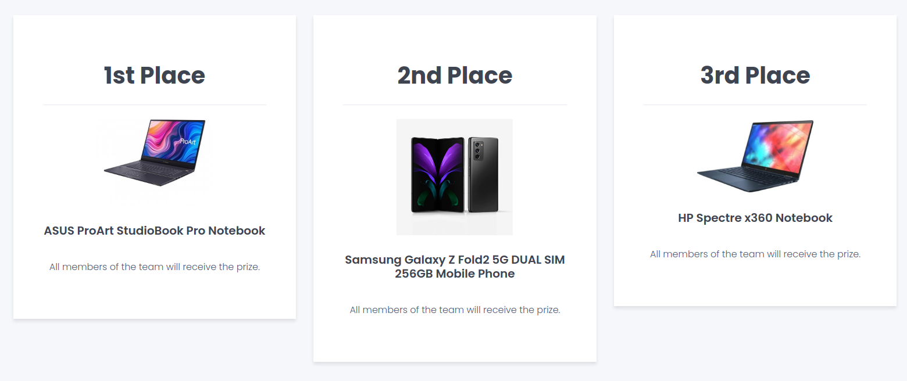

_(The Hungarian version of this article can be found [here](/hu/nisz-verseny-csalodas))_

It's sure been a while since I wrote a post on this blog. I had many posts in mind but little time to sit down and write them. This is a post that I've been wanting to write for a while to finally get it off my chest, mostly to bring awareness upon something I and two other friends of mine had to experience on a Hungarian software development competition.

## First Things First - Who Am I?

Some of you might be interacting with me through this blog post for the first time, so allow me to briefly introduce myself. My name is **József Sallai** and I am a software engineer with many years of experience in the field of developing scalable, performant, and secure applications. I am also currently a university student at Sapientia Hungarian University of Transylvania where I'm majoring in Information and Computer Science.

This article isn't only about me. It's also about two friends of mine and a government-endorsed company that benefited from our work for practically no cost at all.

## What Exactly Is This About?

In winter of 2020, a news article was posted on our university's website about a [competition](https://verseny.nisz.hu/verseny-2021/felsooktatas) which would allow us to test our abilities in software development and win some very cool prizes. What prizes, you might ask?

Some very cool and expensive prizes, right? One would be a fool for not participating in a competition with prizes like that, especially since the organizers ([NISZ, National Infocommunications Services from Hungary](https://nisz.hu/en/)), being endorsed by the Hungarian government, seem to be trustworthy.

At least that's what we thought when [Daniel](https://tohka.us), [Lehel](https://github.com/voidlord), and I have signed up for the competition.

## What We Had To Do

On signup, we didn't know what we had to build, but judging by how much time we had to complete it and the value of the prizes, we were well aware that it's going to be a rather complex project. Which it turned out to be complex when we were notified about the nature of the app we were supposed to build.

Long story short, we were assigned to build a **web application platform** that would allow any two users of the app to create **sale contracts** between each other, fill out the information required by the contract template, digitally sign it, and download it as a PDF. This is merely scratching the surface though since there's many other details and features that we had to keep in mind, however, for the sake of the blog post, this is enough information.

When we signed up, we also had to agree to the terms of the competition, which also stated that **the app we're building and its source code will be the property of NISZ**, so despite being advertised as an "open-source software development competition", everything we did was proprietary and belonged to NISZ (yes, even if we didn't win anything). Additionally, we were not allowed to deploy the app to our own servers, as that would have immediately disqualified us. Instead, we had to use the web server they've provided to us.

The same document also had a paragraph about the prizes we would receive if we won the competition. Apart from the prizes mentioned earlier, the winning team would have also won a **trip to the Hungarian Parliament, insights to how government-managed systems work, and a possibility for an internship at NISZ**.

These are all very important things to keep in mind as we progress further in the article.

## What We've Built

Our app is called **Project Raccoon** (which was originally just going to be a codename but it stuck with us). It was a **Next.js** app written in **TypeScript** which used **TypeORM** to communicate with a database of your choice. We've applied the best development practices that we were aware of in terms of designing and structuring the project's code. In total, we've written around **30000 lines of code** for this project across multiple months.

I also think it's worth mentioning that during the weeks we've worked on the app, we also had other duties, especially since we are university students. At least half of our day was dedicated to university activities and in the meantime, some of us have also done freelance work to earn some money. Besides, at the time this happened, I was going to driving school to get my license. Despite all of these things keeping us busy, we've managed to push our limits and create the best application we could, even if that meant having to skip classes or working on the app while also being in an online class meeting. I also had to postpone some of the work I was doing for money to make enough time for the competition.

By now you should be able to tell that we've definitely put a lot of effort and dedication into this project. And we think it came out great. We don't often say this about the things we're making, but we were really proud of what we managed to pull off together as a team.

At some point before the competition's deadline, we were asked about the tools we needed to deploy our app. Since this was a Next.js app, you could easily deploy it to a serverless platform and use cloud services in tandem, but to keep things simple, all we asked for was a **generic web server that has Node.js and a relational database**. Nothing too complicated.

Fast-forward a few weeks and what we got was some sort of **shared VPS** that we had limited access to. Besides the limited access and the lack of a Node.js runtime in the beginning, the domain we were assigned to pointed to a **PHP server**.

## The Deadline

The (initial) deadline for this project was **April 23**. The app was ready for the base specification, albeit I do have to admit that, at the time, we were lacking some of the features required by the competition's description. Coincidentally, April 23 was also a day when we had an exam, so we had to be very careful with how we managed our time. In the morning, we got access to the web server and after lots of emailing back and forth asking them to install and reconfigure things on the server, we've managed to get the app up and running on their server. Shortly after we got done, the exam started, so there was a lot of stress and pressure going on that day.

We found out that we were competing against **3 other teams**, which, by the time of the deadline, were not ready with their projects. So their deployments were either non-existent or did not work at all. Which might have been one of the reasons the organizers of the competition decided to **extend the deadline by a few days (April 27)**, to make sure the projects are getting completed and we have no issues with the deployment.

We were delighted to hear this, since we noticed a few bugs in the meantime that we were able to fix thanks to the extended deadline.

April 27 came, we have deployed the latest and greatest version of the app to the server provided by NISZ and we went on with our lives, patiently waiting for their feedback on it. In the meantime, some of the other teams were also able to get something deployed, even if it didn't have all the required functionality.

## May

After the deadline was extended, there was a strange radio silence on behalf of NISZ. No feedback, nothing has really changed in the apps or their content... We were starting to worry that something isn't right.

Fast-forward to **May 6**, when they finally replied, telling us that **none of the applications had fulfilled all of the requirements of the competition**, and as such, they are giving every team **one more week to implement the missing features**.

During our email exchange with NISZ, they've also **congratulated us on our app**, saying that they've noticed how much effort went into it and how well it functions and looks. These comments made us more confident that our app will come out victorious and that we will win the competition. They've also told us that if we were to implement the missing features in this extra week, we are **guaranteed to win the first prize**, however, they **doubt** we will be able to deliver them in time.

Briefly, the **missing functionality** was:

- A **property system**, which would allow people to add their properties to a centralized database so they can easily generate a sale contract for them. \*)
- A **digital signature system** (we weren't sure if they meant PKCS 12 signatures for PDF or a frontend for signing documents using handwriting, so we did both).
- An **attestation system**, which would ensure that the generated documents are authentic/legitimate.
- Adding **attachments** to a contract.
- **High-level authentication** (which we will talk about later). \*\*)
- Adding **witnesses and lawyers** to a contract.
- At least one **bonus feature**.

Some of the requirements in their email seemed vague to us, so we emailed them and called them via phone to ask for more details. The ones that were vague to us were:

- \*) "Centralized inventory system", which we assumed meant each user would have their own "inventory" that they can use for generating contracts. We asked them about the way we've envisioned the implementation and all they said was "yes, that sounds good" (paraphrase).
- \*\*) "Emelt szintű azonosítás", which basically stands for "higher-level identification". We assumed this meant the authorization flow for citizens which would hit an internal API to verify if the provided personal details were authentic. Once again, we asked them if our logic was what they were referring to, and they replied with "do it the way you think it would work the best".

That may seem like a lot of work for one week, but that never stopped us. We worked hard until the last moment and delivered what we were asked to do...

## ... or did we?

**May 12** came and we've submitted the **final version of the application** to NISZ' web server, thinking that we did everything that was required by the competition rules. As an added bonus, we've added some **unique features** to the app that weren't in the original specification:

- A **localization system**, which would allow foreigners to do business in Hungary.
- A **light/dark mode switch** for those who don't want to burn their eyes.
- A **specification and mock API** for the authorization/identification API that the app was supposed to check user data against.
- **Signature frontend** for those who want to add a handwritten signature.
- ... and probably a few more features that I had forgotten about

We were under the impression that not only did we complete the whole app as requested, but we've also overachieved in terms of user experience and even developer experience.

After we've submitted the app, its documentation, and its source code, it was radio silence again... until **May 17**, which is when they told us that

> Despite the additional week that we gave you, still **none of the teams were able to fully finish the application as described in the requirements**. However, because we saw that your project was the most developed and required the most time and effort, we will give us a **"special prize"**.

The way they worded it made us realize that the special prize they were referring to was a completely different mysteriously unmentioned prize and NOT any of the three prizes that were initially announced.

In the same email message they've sent on the 17th, they've also told us that we had to **create some sort of pitch video for the project**, which would describe the team, the app, and contain a brief demonstration of how the app works. The deadline was **May 20**. Yep, we had to write the script, film everything, record the demonstration, and edit the video in **less than 3 days**.

But despite the very tight deadline, we still managed to get it done. I wasted **my entire birthday** (May 19) working on the video, recording and editing everything together, just so we can finish it off and send it to them by midnight.

Once we've done that, they've thanked us for the video and told us that they will be back with more details soon.

## The Prize?

A few weeks passed since we've submitted our pitch video. In further exchange, they have also told us that the missing functionality was

> the centralized inventory system, the higher-level identification system, as well as better documentation

Two out of those features could have been easily implemented if there was better communication between NISZ and us and they weren't so vague about the requirements. By "centralized inventory system" they were referring to a **way for site administrators to see everything that gets added to the website**. The second one apparently refers to **two-factor authentication**... I also need to mention that I've **NEVER** seen any Hungarian application that would use the term "emelt szintű azonosítás" to refer to two-factor authentication. I've only ever seen "kétlépcsős hitelesítés" or "kétfaktoros hitelesítés".

In fact, if we were to get pedantic, Googling "emelt szintű azonosítás" will only give you **results to government websites and nisz.hu**. The very first result is from nisz.hu and it refers to **a system that has the ability to ensure the authenticity of a user's personal information**. So I am very certain that the confusion here is very justified.

Either way, in the grand scheme of things, that is pretty much **2%** of the entire project, but for good measure I'll round it up to 5%.

So 95% of the app was complete and fully functional.

**95%.**

That 5% was the reason we **did not win anything** other than a special prize that was later revealed to be an **e-learning kit** worth thousands of Hungarian Forints. For them though, this was nothing but a simple `UPDATE` query in a database. I would also like to mention that the e-learning kit was actually the **3rd prize for the high school** variant of the same competition.

A project that was 95% done to the specification, ~30000 lines of code, many days of work, skipping classes and other duties, skipping celebrating a birthday only to finish a pitch video... and not only is the license of the project currently in a questionable situation, but we also **did not receive anything valuable in return**.

Oh, and did I mention that the other teams got **nothing at all**? Even if their applications weren't fully done or didn't function well, I still feel like they deserved to get something for their work.

And of course, the project and its code, as we agreed to when submitting it to their server, **belongs to NISZ**. We cannot do anything with it (i.e. improve and monetize it) unless we get back our rights to the code. However, I also don't think it's fair that they can break the terms of their own contract at any point in time, so **we still want to demand our rights to the code back**.

## The Small Gift

After a few weeks of being confused about the prize we got, on **June 10**, NISZ emailed us saying

> We want to give you a **small** gift via post, to express our gratitude for joining the competition.

They never specified what the physical gift they wanted to mail to us was, but since they specifically mentioned that it's a **small** gift, we assumed it would be t-shirts or mugs, and perhaps a participation diploma.

We've sent them our mailing addresses. They've **confirmed that they've received the addresses** and that they will mail the gifts to us as soon as possible.

Obviously, we've **never received anything via post**, nor did they say anything ever since June 10. Color me surprised.

## Conclusion

We were, by all intents and purposes, massively screwed over by NISZ, which we assumed to be a trustworthy government-endorsed company. They are about to announce the competition again for 2021, but this time I want to **urge everyone to avoid NISZ and this competition as much as possible**. If you really want to risk not receiving anything unless you do everything 100% as described in the spec (whatever that means, since they are always very vague about everything), then more power to you, but this should serve as a fair warning for what you're getting yourself into. 99.9% won't do, it has to be 100%.

If anything, this was a learning experience to us. It doesn't matter if a company is endorsed by the government, it doesn't make it any more trustable than a random no-name company that announced a competition. Be careful with who you're collaborating with.
